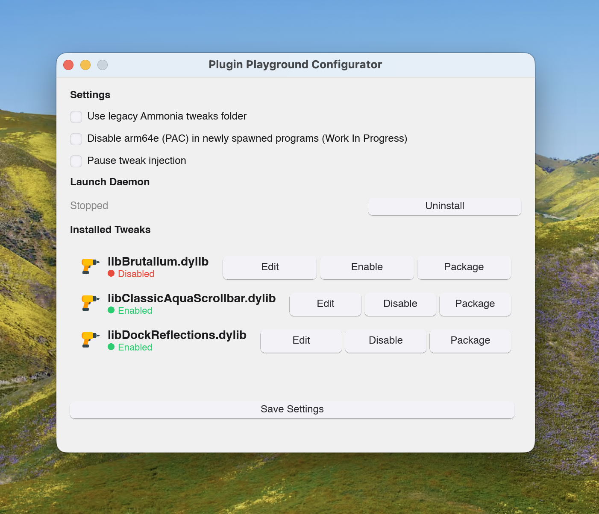
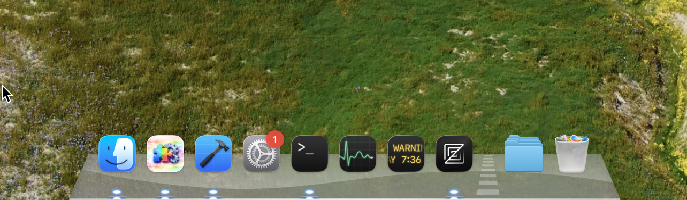
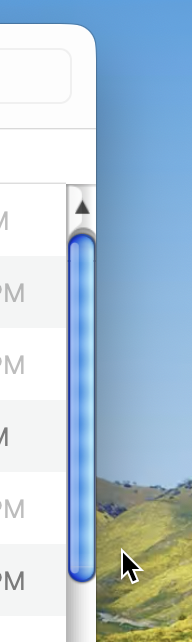

# Plugin Playground

An open-source general-purpose runtime tweak system for macOS Apple Silicon.

> **Warning** System Integrity Protection (SIP) must be partially disabled — `csrutil enable --without fs` — because the tracer needs `task_for_pid()` access to launchd and the ability to set hardware breakpoints on other processes. SIP only needs to be weakened, not fully off.

Plugin Playground provides a framework for intercepting and modifying the behavior of
running processes. It's the foundation for building runtime plugins, introspection tools, and
behavior-modification tweaks on modern macOS.

The fangs tracer must run as **arm64e** (the system ABI for Apple Silicon) to attach
to launchd. If arm64e is not available on your system, toggle **Disable arm64e (PAC)** in the
configurator — this strips PAC signing from spawned processes so injection works without the
native arm64e ABI.

The configuration app is installed to `/Applications/Plugin Playground.app`.



## What Tweaks Do for macOS

Tweaks are `.dylib` libraries injected into macOS processes at spawn time, before `main()` runs. They can modify any aspect of a running app — change UI rendering, alter window management, change system controls, or override literally any framework behavior. The injection is transparent and requires no modification to the target application. Below are two private examples a developer had created with the runtime.

- **Classic Dock** — replaces the modern macOS Dock with a pre-Yosemite style (3D shelf, reflective icons, unified minimize).

- **Classic Scrollbars** — restores legacy scrollbars with up/down arrows at both ends and the classic aqua thumb appearance. 



## Build Requirements

- macOS Apple Silicon (ARM64)
- Xcode Command Line Tools (`xcode-select --install`)
- CMake 3.16+
- git
- Internet connection (first build fetches Slint via FetchContent)

## Build & Install

```sh
sudo ./install.sh
```

This builds everything and produces `PluginPlayground-1.0.0.pkg`. Run the `.pkg` to install, or pass a custom prefix path to install directly without the GUI installer:
